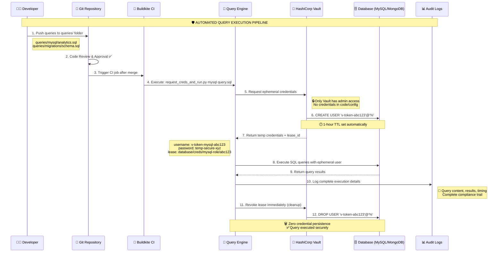
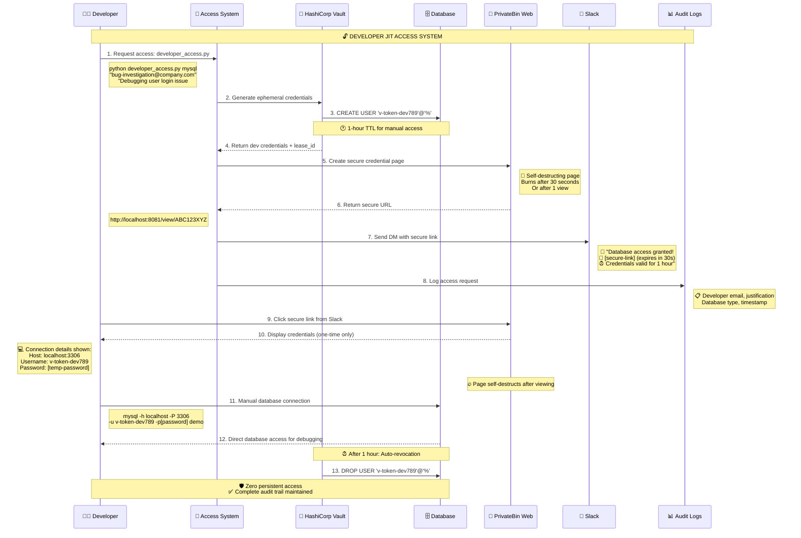

# Secure Database Query Execution

A **Zero-Trust Database Access System** that eliminates the need for developers to have permanent database credentials. This project demonstrates how to safely execute database operations in CI/CD pipelines using ephemeral credentials managed by HashiCorp Vault.


## 🎯 What This System Solves

Instead of developers hardcoding database credentials or storing them in `.env` files, this system:

1. **Stores admin credentials securely** in HashiCorp Vault only
2. **Generates ephemeral database users** on-demand (1-hour TTL)
3. **Executes queries** using temporary credentials that auto-expire
4. **Automatically revokes access** when jobs complete
5. **Provides complete audit trails** for compliance (SOX, HIPAA, PCI-DSS)

## 🏗️ Architecture: Zero-Trust Database Access

### 🔄 Two Core Security Flows

#### 1️⃣ **Automated Query Execution Flow (CI/CD Pipeline)**



#### 2️⃣ **Developer JIT Access Flow (PrivateBin Secure Sharing)**



### 🔄 Vault Credential Engine Mechanism

**How Vault Creates Ephemeral Database Users:**

1. **Admin Storage**: Only Vault stores database admin credentials (root/admin users)
2. **JIT Generation**: When access needed, Vault creates temporary database users:
   ```sql
   -- Vault executes this on MySQL:
   CREATE USER 'v-token-mysql-role-abc123'@'%' IDENTIFIED BY 'temp-password-xyz';
   GRANT SELECT, INSERT, UPDATE ON demo.* TO 'v-token-mysql-role-abc123'@'%';
   ```
3. **Lease Management**: Each credential has a lease_id and TTL (1 hour default)
4. **Auto-Revocation**: Vault automatically drops users when lease expires:
   ```sql
   -- Vault executes this after TTL:
   DROP USER 'v-token-mysql-role-abc123'@'%';
   ```

## 📁 Optimized Project Structure

```
.
├── 📖 README.md                    # This comprehensive guide
├── 🐳 docker-compose.yml           # Infrastructure setup
├── ⚙️ requirements.txt             # Python dependencies
├── 🛠️ Makefile                     # Convenient commands for all operations
├── 🚫 .gitignore                   # Git ignore patterns
├── 📜 scripts/                     # Setup and utility scripts
│   ├── setup_vault.sh              # Vault configuration
│   ├── setup_databases.sh          # Database initialization
│   └── setup_mysql.sql             # MySQL schema
├── 🔧 src/                         # Core application code
│   ├── vault_client.py             # Vault API integration
│   ├── request_creds_and_run.py    # Query execution engine
│   ├── developer_access.py         # JIT access management
│   ├── simple_privatebin.py        # Secure credential sharing
│   └── credential_viewer.py        # Web-based credential viewer
├── 📊 queries/                     # Organized query repository
│   ├── README.md                   # Query documentation
│   ├── examples/                   # Basic examples for testing
│   │   ├── mysql_basic.sql         # MySQL fundamentals
│   │   └── mongodb_basic.json      # MongoDB operations
│   ├── mysql/                      # MySQL-specific queries
│   │   └── user_management.sql     # User administration
│   ├── mongodb/                    # MongoDB-specific queries
│   │   └── analytics.json          # Data analytics operations
│   ├── migrations/                 # Database schema changes
│   │   └── 001_create_audit_table.sql
│   └── production/                 # Production maintenance
│       └── health_check.sql        # System health queries
├── 📋 config/                      # Configuration files
│   └── .buildkite/                 # CI/CD pipeline
│       └── pipeline.yml
├── 📚 docs/                        # Documentation
│   ├── TESTING_GUIDE.md            # Slack and credential testing
│   └── SUMMARY.md                  # Implementation summary
├── 🧪 tests/                       # Test files
│   └── test_vault_integration.py   # Integration tests
├── 📊 logs/                        # Runtime logs and results
│   ├── access_requests_*.log       # Audit trails
│   └── query_results_*.json        # Execution results
├── developer_access.py             # Convenient wrapper script
└── request_creds_and_run.py        # Convenient wrapper script
```

---


